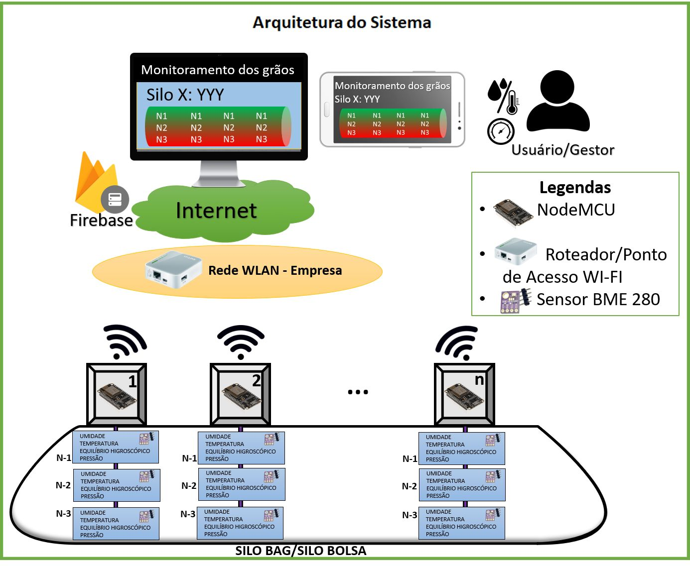
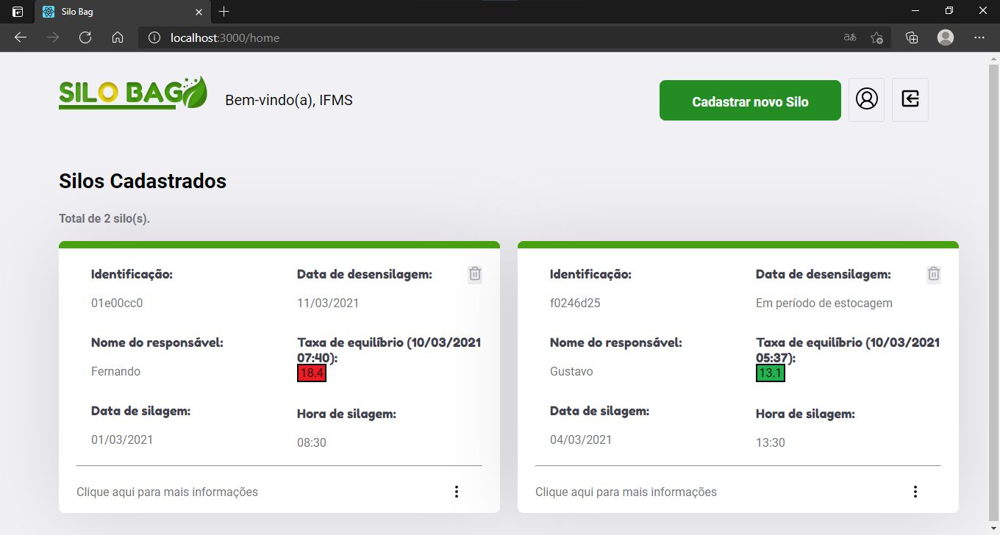

# Monitoramento Silo Bag

<!--

-->

O objetivo do projeto foi desenvolver um sistema completo com a finalidade de monitorar parametros de qualidade da soja armazenada em silos bag.

## 🛠 Tecnologias

As seguintes ferramentas foram usadas na construção do projeto:

* Cors;
* Express;
* Firebase;
* Nodemailer;
* Nodemon;
* React;
* Axios;
* Chart.js;
* intl;
* react-router-do;
* react-confirm-alert;
* react-icons;
* react-toastify;
* React Native;
* React Navigation;
* VSCode.

## Autor

Gustavo Cruz Pinheiro

### Me siga nas redes sociais

